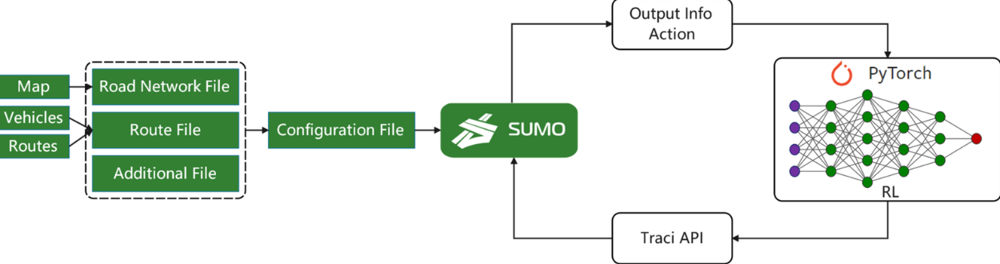
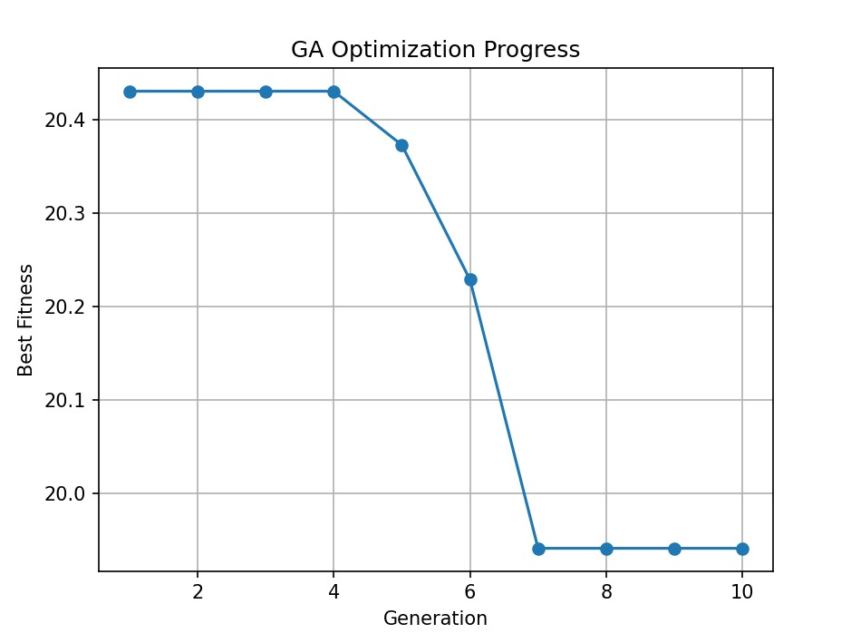

# 🚦 TrafIQ: Intelligent Traffic Signal Control Using Deep Reinforcement Learning

## Overview

**TrafIQ** is an intelligent traffic management system that uses **Deep Reinforcement Learning (DRL)** to optimize traffic signal timings in real-time. By integrating **SUMO (Simulation of Urban Mobility)**, **computer vision**, and advanced RL algorithms, TrafIQ achieves significant improvements in traffic flow, reduced waiting times, and lower vehicular emissions.

### The Problem
Traffic congestion in urban areas is a major challenge:
- **Fixed-timing traffic signals** cannot adapt to dynamic traffic patterns
- **Antiquated systems** waste fuel and increase emissions
- **Manual optimization** is slow and ineffective
- Congestion costs cities billions annually in lost productivity

### The Solution
TrafIQ leverages **Reinforcement Learning** to enable traffic signals that learns optimal policies through interaction with traffic simulation. It adapts dynamically to real-time traffic conditions reducing queue lengths and vehicle waiting times. This minimizes fuel consumption and CO₂ emissions.

---

## Key Features

<p align="center">
  
</p>

###  Multiple RL Algorithms
- **Q-Learning**: Simple, discrete state-action learning
- **DQN (Deep Q-Networks)**: Deep learning for continuous state spaces
- **PPO (Proximal Policy Optimization)**: Stable policy gradient learning
- **MAPPO (Multi-Agent PPO)**: Cooperative multi-intersection optimization
- **Genetic Algorithms**: Evolutionary optimization of signal timings

###  Architecture
- **SUMO Integration**: Realistic microscopic traffic simulation
- **TraCI Interface**: Python API for real-time environment interaction
- **Multi-Agent Support**: Independent and cooperative agent configurations
- **Computer Vision**: YOLO-based vehicle detection and tracking

###  Performance Metrics
- Queue length optimization
- Vehicle waiting time reduction
- Throughput maximization
- Emission tracking (CO₂, fuel consumption)
- Performance smoothing and visualization

---

## Project Structure

```
TrafIQ/
├── agents/
│   ├── single-intersection/        # Single TLS algorithms
│   │   ├── q_learning.py          # Q-Learning implementation
│   │   ├── dqn.py                 # DQN with priority replay buffer
│   │   ├── ppo.py                 # PPO single intersection
│   │   └── genetic_algo.py        # Genetic algorithm optimization
│   └── multi-intersection/         # Multi-agent algorithms
│       ├── independent_ppo.py     # Independent PPO agents
│       └── mappo_coop.py          # Cooperative MAPPO
├── models/
│   └── ppo-single/                # Pre-trained PPO models
│       ├── models/                # Network architectures
│       │   ├── network.py         # Policy & Value networks
│       │   ├── buffer.py          # Rollout buffer
│       │   ├── ppo.py             # PPO agent
│       │   ├── env_sumo_single.py # SUMO environment wrapper
│       │   └── train.py           # Training loop
│       └── models_out/            # Saved checkpoints
├── environments/
│   ├── single-intersection/       # Single TLS SUMO configs
│   │   ├── 4x4-single-grid/      # 4x4 grid network
│   │   └── genetic-env/          # Genetic algo environment
│   └── multi-intersection/        # Multi-TLS SUMO configs
├── mini-projects/                 # Mini-project implementations
│   ├── frozen-lake/              # Frozen Lake Q-Learning
│   ├── taxi/                     # Taxi-v3 environment
│   └── rule-based-sumo/          # Emergency vehicle preemption
├── experiments/
│   └── cv-yolo/                  # YOLO vehicle detection
├── docs/                          # Documentation (MkDocs)
├── constants/                     # Configuration files
├── requirements.txt               # Python dependencies
└── mkdocs.yml                     # Documentation config
```

---

## Installation

### Prerequisites
- **Python 3.8+**
- **SUMO 1.23.0+** ([Installation Guide](https://sumo.dlr.de/docs/Installing/))
- **CUDA-capable GPU** (optional, for faster training)

### Setup

1. **Clone the repository**
   ```bash
   git clone https://github.com/your-username/TrafIQ.git
   cd TrafIQ
   ```

2. **Set SUMO_HOME environment variable**
   ```bash
   export SUMO_HOME=/path/to/sumo
   export PATH=$PATH:$SUMO_HOME/bin
   ```

3. **Install Python dependencies**
   ```bash
   pip install -r requirements.txt
   ```

4. **Verify SUMO installation**
   ```bash
   sumo --version
   ```

---

## Quick Start

### 1. Single Intersection - Q-Learning
```bash
cd agents/single-intersection
python q_learning.py
```
Basic Q-Learning with discrete state-action pairs.

### 2. Single Intersection - DQN
```bash
python dqn.py
```
Deep Q-Networks with prioritized experience replay and multi-objective rewards.

### 3. Single Intersection - PPO
```bash
python ppo.py
```
Advanced policy gradient method with stability and sample efficiency.

### 4. Multi-Intersection - MAPPO (Cooperative)
```bash
cd ../agents/multi-intersection
python mappo_coop.py
```
Cooperative multi-agent PPO for coordinated signal control.

### 5. Genetic Algorithm Optimization
```bash
cd ../agents/single-intersection
python genetic_algo.py
```
Evolutionary approach to optimize signal phase durations.

---

## Algorithms Explained

### Q-Learning
A simple tabular RL algorithm for discrete environments. Updates Q-values based on temporal difference error.

**Best for:** Small state spaces, educational purposes

```python
Q(s,a) = Q(s,a) + α[r + γ·max(Q(s',a')) - Q(s,a)]
```

### DQN (Deep Q-Networks)
Uses neural networks to approximate Q-values with prioritized experience replay for improved sample efficiency.
**Best for:** Large/continuous state spaces, complex traffic patterns
**Key features:**
- Experience replay buffer
- Target network for stability
- Prioritized sampling (PER)
- Huber loss for robustness

### PPO (Proximal Policy Optimization)
A policy gradient method that ensures stable learning by clipping policy updates.
**Best for:** Continuous control, reliability, scalability
**Key features:**
- Clipped surrogate objective
- GAE (Generalized Advantage Estimation)
- Entropy regularization
- Multiple epoch updates

<p align="center">
  
  
  
</p>


### MAPPO (Multi-Agent PPO)
Extends PPO to multi-agent scenarios with either independent or centralized training approaches.
**Independent PPO:** Each agent learns independently
**Cooperative MAPPO:** Centralized critic with independent actors

### Genetic Algorithm
Evolutionary approach inspired by natural selection for finding near-optimal signal timings.
**Best for:** Black-box optimization, parameter tuning

<p align="center">
  
</p>


---

## Reward Structure

All agents optimize a **multi-objective reward function**:

```python
Reward = w₁·ΔWaitingTime + w₂·ΔQueueLength + w₃·ΔThroughput 
         + w₄·ΔSpeed + w₅·ΔEmissions + Penalties
```

### Objectives
- **Minimize:** Vehicle waiting time, queue length, emissions (CO₂, fuel)
- **Maximize:** Throughput, average speed
- **Penalty:** Excessive queue buildup (> 15 vehicles)

---

## Features & Capabilities

###  Mini-Projects
Learn fundamental RL concepts with beginner-friendly environments:

1. **Frozen Lake** - Navigate a grid world with stochastic transitions
2. **Taxi-v3** - Pick up and drop off passengers efficiently
3. **Emergency Preemption** - Rule-based emergency vehicle priority handling

###  Computer Vision
YOLO-based vehicle detection and counting:
```bash
cd experiments/cv-yolo
python yolo_traffic.py
```
Tracks vehicles crossing a virtual line in real traffic video footage.

---

## Training Results

### Typical Improvements
- **Queue Length:** ↓ 40-50% reduction
- **Waiting Time:** ↓ 35-45% reduction
- **Throughput:** ↑ 20-30% increase
- **Emissions:** ↓ 30-40% CO₂ reduction

### Learning Curves
- **Raw performance** (noisy but shows true dynamics)
- **Moving average** (window=20, reveals trends)
- **Gaussian smoothed** (σ=2, clean visualization)

---

## Documentation

Full documentation is available on our [project documentation mkdocs](https://sofiaabidi.github.io/TraffIQ-Project-X-2025/):


## Project Contributors

- **Ojas Alai** — [@ojasalai27](https://github.com/ojasalai27)
- **Sofia Abidi** — [@sofiaabidi](https://github.com/sofiaabidi)

### Mentors
- **Yashvi Mehta**
- **Mahi Palimkar**


**Hosted by:** Project X, VJTI's exclusive CoC club

---

## Requirements

```
gymnasium>=0.26.0
numpy>=1.21.0
torch>=1.9.0
matplotlib>=3.3.0
scipy>=1.7.0
ultralytics>=8.0.0  # YOLO
opencv-python>=4.5.0
```


<div align="center">

**Made with ❤️ by the TrafIQ team**

⭐ If you find this project useful, please consider starring it!

</div>
