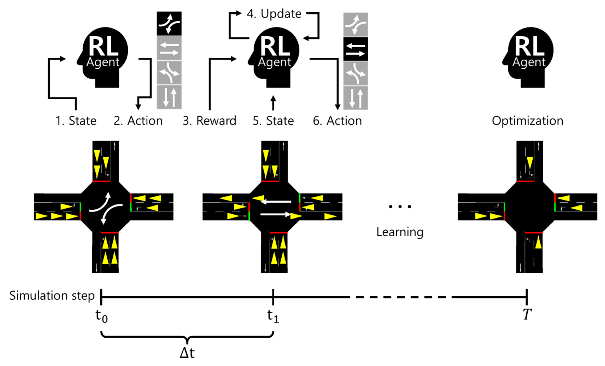

# 🚦** Welcome to TrafIQ**

Traffic congestion has become a defining challenge of urban life in India, with cities routinely paralysed by **gridlocked intersections**, **prolonged wait times**, and rising levels of **fuel consumption** and **air pollution**.  

At the heart of this dysfunction lies an **antiquated system of fixed-timing traffic signals** — blind to the real-time movement of vehicles, insensitive to fluctuating demand, and incapable of adapting to the dynamic rhythm of urban mobility.

---

### The Challenge

Despite the rapid growth of cities and vehicles, traffic management systems have remained **stubbornly unresponsive**, unable to match the pace of urban transformation.  
The following manual approaches have been attempted in the past:

1. **Adaptive Traffic Signal Control (ATSC):** Sets different signals according to different geographical areas.  
2. **Pressurized Routing Algorithms:** Optimize vehicle flow through pressure-based decision rules.  
3. **Greedy Models & 2D Automata Matrices:** Simulate vehicle movements using simplified assumptions.  
4. **Holiday Factor Consideration:** Adjust timing based on calendar and event-based traffic variations.

While these methods have seen limited success, traffic signal control remains a **complex optimization problem**.  
Several **intelligent algorithms** — including *fuzzy logic*, *evolutionary algorithms*, and *reinforcement learning (RL)* — have been explored to address this issue.

---

### Incorporating Reinforcement Learning

Traffic signal control is fundamentally a **sequential decision-making** problem, making it ideally suited to the **Markov Decision Process (MDP)** and RL framework.  
In this setup, an "agent" learns optimal control policies through **trial and error interactions** with its environment.

| Element | Description |
|----------|--------------|
| **State (S)** | Represents the current environment (e.g., vehicle queues, signal phase). |
| **Action (A)** | The timing adjustment taken by the agent. |
| **Reward (R)** | A numerical feedback, tied to reduced waiting time or congestion. |
| **Policy (π)** | The strategy mapping states to actions. |
| **Value Function (V)** | Estimates expected cumulative rewards from a given state. |

The goal is to learn an **optimal policy (π\*)** that maximizes the **discounted cumulative reward**, ensuring smoother traffic flow through continuous adaptation.

---

---

### The **TrafIQ Pipeline**

The **TrafIQ** system integrates **computer vision**, **SUMO**, and **deep reinforcement learning** into a unified pipeline:

SUMO (Simulation of Urban Mobility) reflects real-world traffic behavior.  Through **TraCI**, a Python controller retrieves live state data every second — including:
   - Vehicle positions  
   - Speeds  
   - Queue lengths  
   - Emission levels  
Deep RL agents (e.g., **Q-Learning**, **PPO**, **DQN**,**MAPPO**) consume this data to decide optimal signal phases, which are then applied back into SUMO creating a feedback loop.

---
