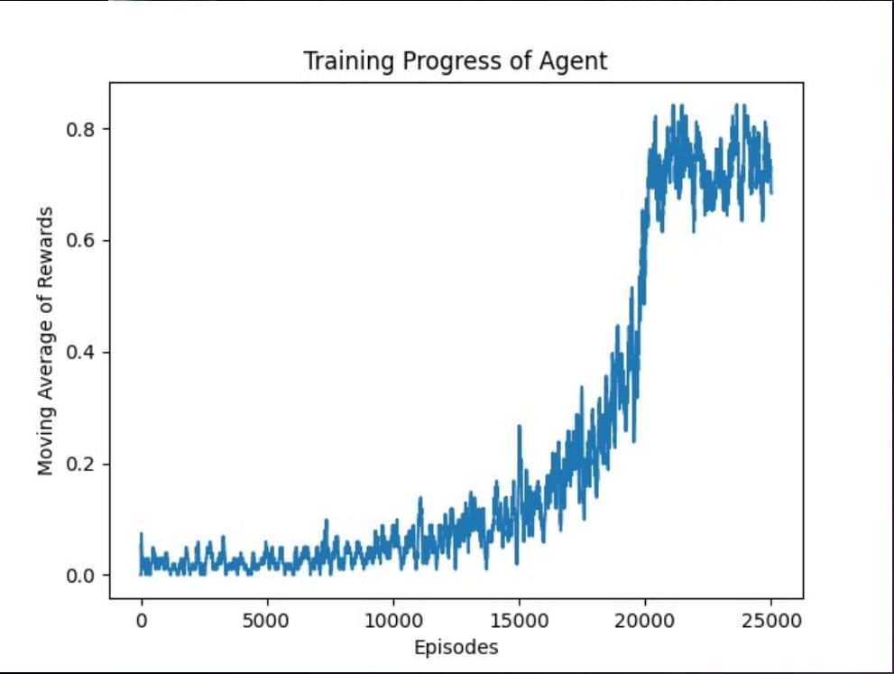

## **Description**
The Frozen Lake environment from OpenAI Gym is a classic reinforcement learning task designed to test an agent’s ability to learn optimal policies in a stochastic, slippery environment.

It consists of a grid world where the agent must navigate from a Start (S) position to a Goal (G) position while avoiding Holes (H) scattered across a frozen surface. The agent can move Up, Down, Left, or Right, but due to the slippery nature of the ice, its movements are not always deterministic — it might slide in an unintended perpendicular direction.

Holes in the ice are distributed in set locations when using a pre-determined map or in random locations when a random map is generated. Randomly generated worlds will always have a path to the goal.

## Action Space

The action shape is (1,) in the range {0, 3} indicating which direction to move the player.
0: Move left
1: Move down
2: Move right
3: Move up

## Observation Space

The observation is a value representing the player’s current position as current_row * ncols + current_col (where both the row and col start at 0). Therefore, the observation is returned as an integer.
For example, the goal position in the 4x4 map can be calculated as follows: 3 * 4 + 3 = 15. The number of possible observations is dependent on the size of the map.

## Reward Structure

Default reward schedule:

Reach goal: +1
Reach hole: 0
Reach frozen: 0
See reward_schedule for reward customization in the Argument section.

## Our Implementation & Results

