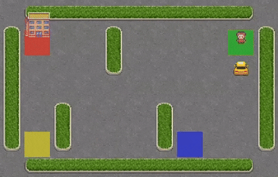
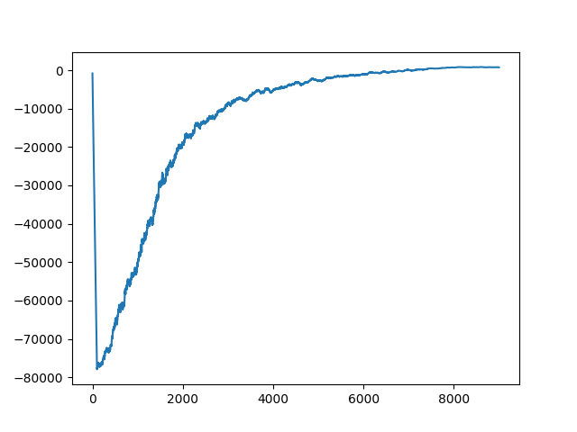

## Description

The Taxi-v3 environment is a classic reinforcement learning problem from OpenAI Gym that simulates a grid-based world where an autonomous taxi must efficiently pick up and drop off passengers at designated locations. Despite its simplicity, it provides an excellent testbed for exploring multi-objective reinforcement learning (MORL).

The pickup and drop-off points are randomly assigned at the start of each episode, ensuring dynamic task scenarios.



## Action Space
The action shape is (1,) in the<video controls src="fl.mp4" title="Title"></video> range {0, 5} indicating which direction to move the taxi or to pickup/drop off passengers.

* 0: Move south (down)
* 1: Move north (up)
* 2: Move east (right)
* 3: Move west (left)
* 4: Pickup passenger
* 5: Drop off passenger

## Observation Space
There are 500 discrete states since there are 25 taxi positions, 5 possible locations of the passenger (including the case when the passenger is in the taxi), and 4 destination locations.


Passenger locations:
```
0: Red
1: Green
2: Yellow
3: Blue
4: In taxi
```
Destinations:
```
0: Red
1: Green
2: Yellow
3: Blue
```
An observation is returned as an int() that encodes the corresponding state, calculated by 
```((taxi_row * 5 + taxi_col) * 5 + passenger_location) * 4 + destination 
```
## Reward Structure

* -1 per step unless other reward is triggered.
* +20 delivering passenger.
* -10 executing “pickup” and “drop-off” actions illegally.

## Our Implementation & Results

