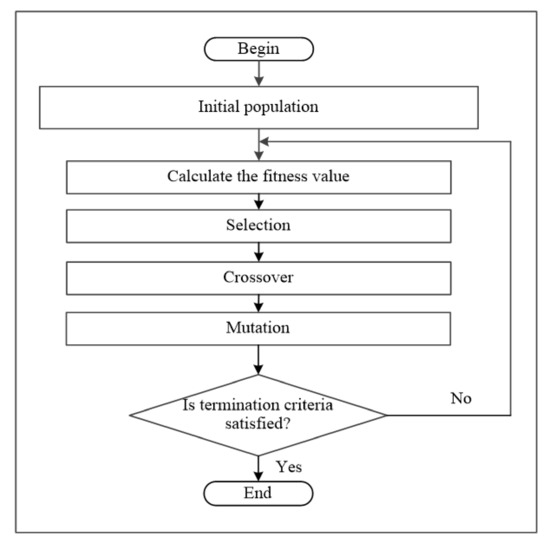

# 🚦 TLS Optimization using Genetic Algorithm and SUMO
 
The optimization minimizes the **average vehicle waiting time** and **queue length**, while maximizing **throughput**.

---

## What is a Genetic Algorithm (GA)?

A **Genetic Algorithm (GA)** is an **evolutionary optimization technique** inspired by the process of **natural selection** in biology.  
It is useful when the search space is large and complex — where traditional methods (like brute-force or gradient-based optimization) are not feasible.

---

---

### Genetic Algorithm Steps

| Step | Process | Description |
|------|----------|-------------|
| **1. Initialization** | Create a random population | Each individual (chromosome) represents a possible traffic signal plan — e.g., `[30, 3, 45, 4]` for green/yellow durations. |
| **2. Fitness Evaluation** | Evaluate each solution | Simulate each plan in SUMO and calculate its **fitness** (based on wait time, queue length, throughput). |
| **3. Selection** | Choose the best solutions | Better-performing solutions have higher chances of being selected for reproduction. |
| **4. Crossover (Recombination)** | Combine two solutions | Mix timing values from two parents to create new offspring with potentially better performance. |
| **5. Mutation** | Randomly change some values | Introduce randomness (e.g., slightly changing a green duration) to maintain diversity and explore new possibilities. |
| **6. Replacement** | Form a new population | Keep the best individuals (elitism) and replace the worst ones with new ones. |
| **7. Termination** | Stop after certain generations | End when improvement slows or a maximum generation count is reached. |

---

### 🚦 Why Use a Genetic Algorithm for Traffic Optimization?

| Challenge | Why GA Helps |
|------------|--------------|
| **Dynamic and nonlinear environment** | Traffic flow depends on multiple interacting factors (routes, timings, vehicle arrivals). GA can search through complex spaces without needing explicit formulas. |
| **No single best timing plan** | GA can adaptively find near-optimal signal timings even as traffic conditions change. |
| **Multi-objective optimization** | GA can balance competing objectives (e.g., reducing waiting time, minimizing queue length, maximizing throughput). |

> **In short:** GA mimics natural evolution to continuously improve traffic light timings — leading to smoother traffic flow and reduced congestion.

---

---

