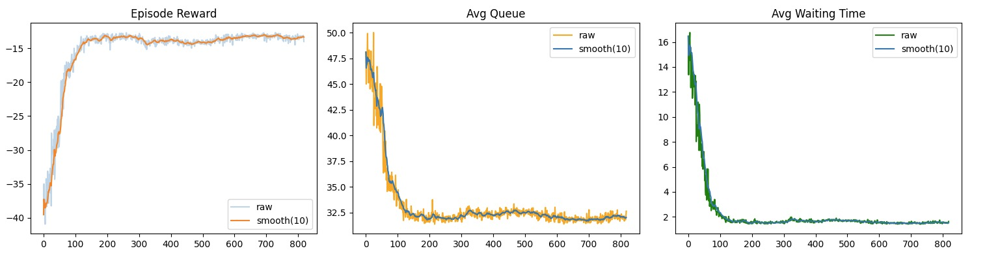

# PPO (Proximal Policy Optimization)
## Description 

Proximal Policy Optimization (PPO) is a powerful Deep Reinforcement Learning (DRL) algorithm that strikes an ideal balance between performance, stability, and sample efficiency. It improves upon traditional policy gradient methods by ensuring that policy updates are neither too small (leading to slow learning) nor too large (causing instability).

## Its Role in Traffic Optimization

|-------------|--------------------------|
| **Adaptability** | Learns to adjust signal timings dynamically based on real-time traffic density, flow, and patterns. |
| **Stability** | Uses a clipped objective function to prevent drastic policy changes, ensuring smooth and reliable learning. |
| **Scalability** | Performs efficiently even in large urban networks with many intersections and vehicles. |
| **Continuous Control** | Works effectively in environments with continuous state and action spaces, ideal for traffic signal phase timing. |

## Our Implementation

